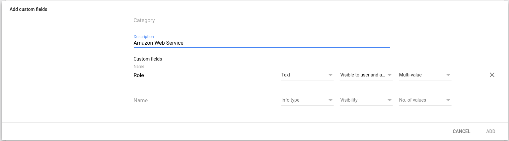
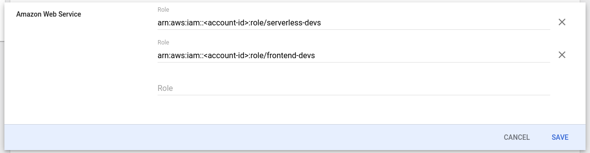
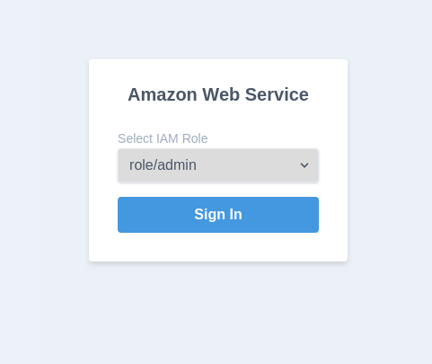

# Cloudcreds

Secure access to your organization's AWS accounts for both programmatic and console use-case via federated identity

- ✅ Credentials are short-lived (Min: 1h, Max: 12h)
- ✅ Fine-grained RBAC (via [Google Admin CustomSchemas](https://developers.google.com/admin-sdk/directory/v1/guides/manage-schemas))
- ✅ Easy deployment (via docker, kustomize and executables)

Demo 👇

[](https://www.youtube.com/watch?v=onBf6JFj-IU)

## Getting Started

### Create an OAuth Client

Create a Google Oauth Client by following this tutorial: https://support.google.com/cloud/answer/6158849?hl=en

Make sure it's an internal app usable only by your hosted domain, i.e: Emails with hosted domain pointing to "acme.com".

Also, generate a client credential and whitelist the following redirect URI which will be pointing to the cloudcreds server.

`https://$CLOUDCREDS_SERVER_URL/callback`

or

`https://cloudcreds.acme.com/callback`


### Create an IAM Role for Web Identity

Create an IAM role on AWS with any permissions you'd like to grant this role. Next, attach a trust policy between this role and your OAuth Client to allow it to be assumed with a Web Identity.

```json
{
  "Version": "2012-10-17",
  "Statement": [
    {
      "Effect": "Allow",
      "Principal": {
        "Federated": "accounts.google.com"
      },
      "Action": "sts:AssumeRoleWithWebIdentity",
      "Condition": {
        "StringEquals": {
          "accounts.google.com:aud": "<google-oauth-client-id>"
        }
      }
    },
  ]
}
```

### Attach IAM Roles to GSuite Users

Follow this tutorial to create a custom attribute for your users: https://support.google.com/a/answer/6208725?hl=en

Category has to be named as `Amazon Web Service`



Once that's done, attach any IAM role that has the correct trust policy attached to it:



### Setup Server

If you're using docker or any container based platform you may do so like this:

```bash
docker run \
  -e CLOUDCREDS_SERVER_URL=https://cloudcreds.acme.com \
  -e CLOUDCREDS_SERVER_CLIENT_ID=<google-oauth-client-id> \
  -e CLOUDCREDS_SERVER_CLIENT_SECRET=<google-oauth-client-secret> \
  imranismail/cloudcreds:v1 serve
```

If you want to test this out locally. Create a file in `~/.cloudcreds.yaml` with the following content

```yaml
server:
  # debug flag
  debug: true
  # public URL of the server
  url: "https://cloudcreds.internal.acme.com"
  # hostname to be bind
  hostname: "127.0.0.1"
  # port to be bind
  port: 1337
  # key used to encrypt cookie session
  session_key: please-set-this-to-a-high-entropy-string
  # oauth credentials, you can follow along this tutorial to generate them:
  # make sure to set your:
  # - authorized domain
  # - default scopes
  # - whitelisted callback
  # https://support.google.com/cloud/answer/6158849?hl=en
  client_id: "<google-oauth-client-id>"
  client_secret: "<google-oauth-client-secret>"
  # supports only google for now
  # future plans includes github, auth0 and other oidc adapters
  issuer_url: "https://accounts.google.com"
  # your organization hosted domain e.g: youremail@hosted_domain.com
  hosted_domain: "*"
  # these are the default scopes needed
  scopes:
  - email
  - profile
  - openid
  - https://www.googleapis.com/auth/admin.directory.user.readonly
```

Run `cloudcreds serve` to fire up a local server

### Assume A Role

Create a file in `~/.cloudcreds.yaml` with the following content:

```yaml
client:
  # Debug flag
  debug: true
  # Local URL to host and open the temporary client-server to initiate auth with cloudcreds server
  url: "http://127.0.0.1:1338"
  # cloudcreds server URL
  server_url: "http://127.0.0.1:1337"
```

Then you can use one of the following commands to access AWS

`cloudcreds login`

or

`cloudcreds console`

Do the whole OAuth dance and once that's done you will be shown a page to select a role:



Assuming a role will either output the credentials to your CLI or redirect you to AWS Console

## Full Config Reference

*All values are default*

```yaml
client:
  # Debug flag
  debug: true
  # Local URL to host and open the temporary client-server to initiate auth with cloudcreds server
  url: "http://127.0.0.1:1338"
  # cloudcreds server URL
  server_url: "http://127.0.0.1:1337"
server:
  # debug flag
  debug: true
  # public URL of the server
  url: "https://cloudcreds.internal.acme.com"
  # hostname to be bind
  hostname: "127.0.0.1"
  # port to be bind
  port: 1337
  # key used to encrypt cookie session
  session_key: please-set-this-to-a-high-entropy-string
  # oauth credentials, you can follow along this tutorial to generate them:
  # make sure to set your:
  # - authorized domain
  # - default scopes
  # - whitelisted callback
  # https://support.google.com/cloud/answer/6158849?hl=en
  client_id: "<google-oauth-client-id>"
  client_secret: "<google-oauth-client-secret>"
  # supports only google for now
  # future plans includes github, auth0 and other oidc adapters
  issuer_url: "https://accounts.google.com"
  # your organization hosted domain e.g: youremail@hosted_domain.com
  hosted_domain: "*"
  # these are the default scopes needed
  scopes:
  - email
  - profile
  - openid
  - https://www.googleapis.com/auth/admin.directory.user.readonly
```

### Environment Variables

Any of the configs provided can be overridden using Environment Variables with the following convention:

`CLOUDCREDS_SERVER_SCOPES="email,profile,openid"`